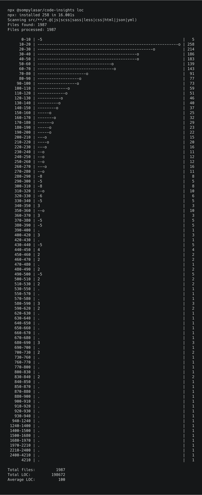
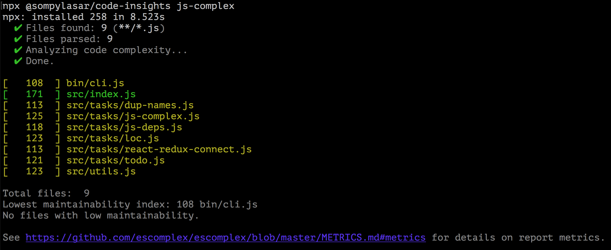

# `code-insights`

A toolbox of CLI tools that analyze web application or Node.js source code and show some stats useful for code health maintenance and refactoring.

The implementation is not robust i.e. sometimes uses a quick-n-dirty `indexOf` or `RegExp` instead of a full AST parser so may potentially give a few false positives on large and complex code base, but it is good enough to get an overview of a code base.

The tools are not split into individual packages, so the dependencies of all the tools have to be installed even if you only need one tool. For now, this is by design, to use common utility functions and reduce extra cost of managing several small packages.

## Demos

<details>
<summary>Demo: loc</summary>

</details>

<details>
<summary>Demo: js-complex</summary>

</details>

## Usage

Run in a directory of interest via [`npx`](https://www.npmjs.com/package/npx):

```
cd your-project-folder
npx @sompylasar/code-insights <tool-name> [tool-arg]...
```

## Commands

```
Run a tool from the toolbox.

Usage: npx @sompylasar/code-insights <tool-name> [tool-arg]...

Options:
  --help  This help.

Examples:
  npx @sompylasar/code-insights js-complex

  npx @sompylasar/code-insights todo --write

  npx @sompylasar/code-insights --help

```

### `dup-names`

```
Find duplicate file names across directories.

Usage: npx @sompylasar/code-insights dup-names [options]

Options:
  --js-only  Scan JavaScript (.js) files only. Default: js|scss|sass|less|css|html|json|yml

  --help     This help.

```

### `js-complex`

```
Measure JavaScript code maintainability index of each source file via "escomplex".

Usage: npx @sompylasar/code-insights js-complex [options]

Options:
  --grep <regexp>  Regular expression to match the relative file paths against.

  --invert         Inverts the regular expression to ignore the matching files.

  --verbose        Print detailed report.

  --help           This help.

Examples:
  npx @sompylasar/code-insights js-complex

  npx @sompylasar/code-insights js-complex --grep '.*/components/.*'

  npx @sompylasar/code-insights js-complex --grep '.*/test/.*' --invert

  npx @sompylasar/code-insights js-complex --verbose

```

### `js-deps`

```
Find dependencies inside source code files.

Usage: npx @sompylasar/code-insights js-deps [options]

Options:
  --verbose  List all found dependencies.

  --help     This help.

```

### `loc`

```
Count lines of code (LOC) of each file, aggregate statistics.

Usage: npx @sompylasar/code-insights loc [options]

Options:
  --js-only  Scan JavaScript (.js) files only. Default: js|scss|sass|less|css|html|json|yml

  --help     This help.

```

### `react-redux-connect`

```
Find files that may contain React Redux connected components, i.e. import from "react-redux" or "redux-form".

Usage: npx @sompylasar/code-insights react-redux-connect [options]

Options:
  --help  This help.

```

### `todo`

```
Collect TODO comments from source code files into a Markdown list.

Usage: npx @sompylasar/code-insights todo [options]

Options:
  --write [filename]          Write the file and add it to Git. Default file name: TODO.md

  --team-username <username>  GitHub username of the team.

  --skip-git                  Do not try to add the file to Git.

  --help                      This help.

```
